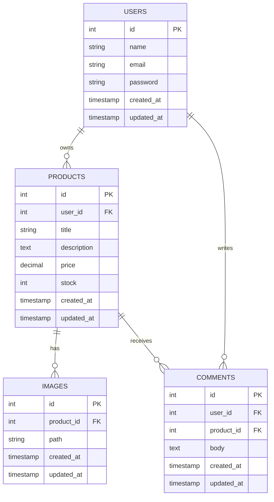

# E-Commerce Laravel API

A clean and fully working **E-Commerce REST API** built with Laravel.  
The project supports:
- Authentication (Laravel Sanctum)
- Redis Caching for product listing

---

## Requirements

- PHP 8.2+
- Composer
- MySQL
- Redis
- Laravel CLI
- Postman (for testing APIs)

---

## Installation & Setup

1. **Clone the repository**
```bash
git clone https://github.com/Abdelrahman435/E-Commerce.git
cd E-Commerce
```

2. **Install dependencies**
```bash
composer install
```

3. **Copy & configure `.env`**
```bash
cp .env.example .env
```

Edit `.env` (example values):
```
DB_DATABASE=your_db
DB_USERNAME=root
DB_PASSWORD=

CACHE_DRIVER=redis
REDIS_HOST=127.0.0.1
REDIS_PORT=6379

FILESYSTEM_DRIVER=public
```

4. **Generate app key**
```bash
php artisan key:generate
```

5. **Run migrations**
```bash
php artisan migrate
```

6. **(Optional) Seed database**
```bash
php artisan db:seed
```

7. **Storage link for product images**
```bash
php artisan storage:link
```

8. **Clear caches (recommended)**
```bash
php artisan config:clear
php artisan cache:clear
php artisan route:clear
php artisan view:clear
```

9. **Start server**
```bash
php artisan serve
```
Default: `http://localhost:8000`

---

## API Overview

### Auth
- `POST /api/register`
- `POST /api/login`
- `POST /api/logout` (requires token)

### Products
- `GET /api/products` → List products (with images & comments)
- `GET /api/products/{id}` → Get single product
- `POST /api/products` → Create product (auth required)
- `PUT /api/products/{id}` → Update product (auth required)
- `DELETE /api/products/{id}` → Delete product (auth required)

### Product Images
- `POST /api/products/{id}/images` → Upload multiple images (auth required)
- `DELETE /api/products/{id}/images/{imageId}` → Delete image (auth required)

### Comments
- `POST /api/products/{id}/comments` → Add comment (auth required)

---

## Caching

- Redis is used for caching product lists.
- Cache key is generated from request filters and pagination.
- Cache TTL: **10 minutes**.
- Cache is cleared automatically when a product is created, updated, or deleted.

`.env` sample for Redis:
```env
CACHE_DRIVER=redis
REDIS_HOST=127.0.0.1
REDIS_PORT=6379
```

---

## ERD (Entity Relationship Diagram)



## Assumptions

- Only authenticated users can create/update/delete products & comments.
- Product images are uploaded via `multipart/form-data` and saved to `storage/app/public/product_images`.
- Image URLs are returned fully qualified (`http://localhost:8000/storage/...`).
- Pagination used for product listing (`per_page` query param supported).
- Redis is optional but recommended for caching.

---

## Notes

- Transformations applied so each product has:
  - `images`: array of full URLs
  - `comments`: array of objects `{ body, user_name }`
- Cache invalidation runs on product create/update/delete.

---

## License

MIT
